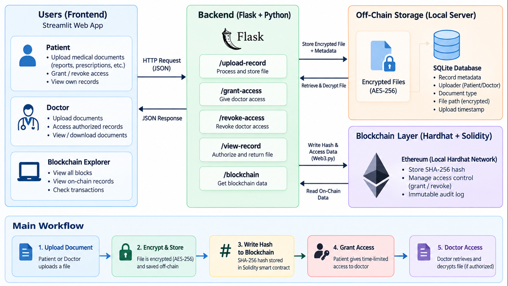
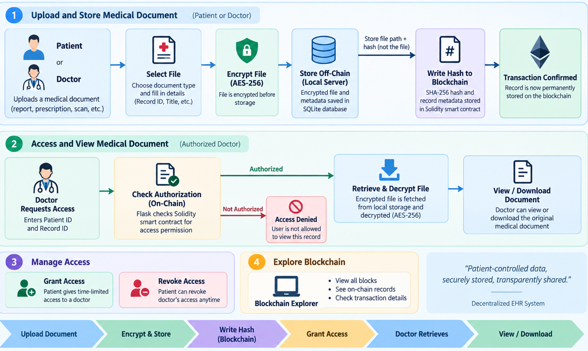

# Patient-Centric Decentralized EHR System

A blockchain-based, patient-centric Electronic Health Record (EHR) system designed to provide secure medical-document storage, patient-controlled access, document integrity verification, and transparent blockchain records.

> **Project Type:** Academic / Mini Project Prototype  
> **Blockchain:** Local Ethereum-compatible Hardhat network  
> **Storage Model:** Encrypted off-chain files + blockchain-backed record integrity and access control

---

## 📌 Overview

The **Patient-Centric Decentralized EHR System** combines blockchain technology, encrypted off-chain storage, and a web-based application to manage medical records securely.

Medical documents such as **lab reports, prescriptions, doctor notes, scans/X-rays, discharge summaries, vaccination records, and medical certificates** are encrypted using **AES-256** before being stored off-chain. A **SHA-256 fingerprint** of the original document is recorded through the Solidity smart contract so that the document's integrity can be verified later.

Patients can upload their own medical documents and control doctor access through **grant/revoke** operations. Authorized doctors can request a record, after which the system checks blockchain authorization, decrypts the off-chain document, and compares its SHA-256 fingerprint with the value stored on-chain.

The project also includes a **Blockchain Explorer** to display blocks, transactions, and on-chain EHR records.

---

## ✨ Key Features

- 🔐 AES-256 encryption for medical documents
- #️⃣ SHA-256 document fingerprinting and integrity verification
- ⛓️ Solidity smart contract for blockchain-backed EHR records
- 👤 Patient-centric access control
- 👨‍⚕️ Doctor access through grant/revoke permissions
- 📁 Encrypted off-chain medical-file storage
- 🗃️ SQLite database for off-chain metadata
- 🌐 Flask REST API backend
- 🖥️ Streamlit web interface
- 🔎 Blockchain Explorer with block and transaction details
- 📄 Support for multiple medical-document types and file formats
- ✅ Authorization → Decryption → Integrity Verification workflow

---

## 🏗️ System Architecture

The system follows a **hybrid on-chain/off-chain architecture**. Large and sensitive medical files are kept off-chain in encrypted form, while the blockchain stores the information required for record verification and access control.

### Architecture Diagram



### Architecture Components

| Layer | Technology | Responsibility |
|---|---|---|
| User Interface | Streamlit | Patient and doctor interaction, upload, access management, consultation, blockchain explorer |
| Backend | Flask + Python | REST APIs, application logic, validation, record retrieval |
| Database | SQLite | Off-chain metadata, file path, document information, AES key, IV |
| Secure Storage | Local file storage | Encrypted medical files (`.enc`) |
| Blockchain | Hardhat + Ethereum-compatible local network | Blockchain execution and transaction processing |
| Smart Contract | Solidity | Record registration, document hash storage, access permissions |
| Blockchain Bridge | Web3.py | Python-to-blockchain communication |
| Cryptography | AES-256 + SHA-256 | Document confidentiality and integrity verification |

---

## 🔄 System Flow

### System Flow Diagram



### Document Upload Flow

1. Patient or doctor selects a medical document.
2. The Flask backend validates the record information, uploader, document type, and file extension.
3. The original document is read as bytes.
4. SHA-256 is calculated to create the document fingerprint.
5. AES-256 encrypts the document.
6. The encrypted file is stored off-chain as a `.enc` file.
7. Metadata, encrypted-file path, AES key, and IV are stored in SQLite.
8. The record ID, patient ID, doctor ID, title, and SHA-256 fingerprint are sent to the Solidity smart contract.
9. A blockchain transaction is created and confirmed.
10. The application returns the transaction hash and block number.

### Doctor Consultation Flow

1. The doctor requests a medical record using its record ID.
2. The backend checks the patient's doctor authorization through the smart contract.
3. If access is denied, the request stops.
4. If access is allowed, the backend retrieves the encrypted file and AES key/IV from off-chain storage.
5. The encrypted document is decrypted using AES-256.
6. SHA-256 is calculated again on the decrypted document.
7. The new hash is compared with the SHA-256 fingerprint stored on-chain.
8. If the hashes match, the record is marked **Integrity Verified** and returned to the authorized user.

---

## 🔐 What Is Stored On-Chain vs Off-Chain?

### On-Chain — Solidity Smart Contract

The blockchain stores record and access-control information such as:

- Record ID
- Patient ID
- Doctor ID
- Document title
- SHA-256 document fingerprint
- Record creation timestamp
- Access permissions / authorization state
- Smart-contract events for record creation and access changes

### Off-Chain — SQLite + Encrypted File Storage

The off-chain layer stores:

- Original filename
- MIME type
- Document type
- Uploader role and uploader ID
- Encrypted file path
- AES encryption key
- AES initialization vector (IV)
- Upload timestamp
- The encrypted medical document itself (`.enc`)

> The actual medical PDF/image/document is **not stored directly on the blockchain**.

---

## 🔒 Security Model

### AES-256 Encryption

Before storage, the uploaded medical document is encrypted using AES-256. The encrypted output is saved off-chain instead of storing the readable medical document.

### SHA-256 Integrity Verification

A SHA-256 fingerprint is calculated from the original medical document and recorded on-chain. During consultation, the decrypted file is hashed again. Matching fingerprints indicate that the retrieved document matches the blockchain-registered fingerprint.

### Blockchain Access Control

Patient-controlled permissions are managed through Solidity functions for:

- Granting doctor access
- Revoking doctor access
- Checking current authorization

### Important Prototype Note

This project is an **academic prototype**. It demonstrates the architecture and workflow of blockchain-backed EHR management locally. It is not intended to be used as a production healthcare system without additional security controls, identity management, key-management infrastructure, compliance controls, monitoring, and scalable storage.

---

## 🧰 Technology Stack

### Frontend

- Streamlit
- Python

### Backend

- Flask
- Python
- REST API

### Blockchain

- Solidity `^0.8.24`
- Hardhat
- Web3.py
- Ethereum-compatible local blockchain

### Database & Storage

- SQLite
- Local encrypted file storage

### Cryptography

- PyCryptodome
- AES-256-CBC
- SHA-256

### Development Tools

- Node.js
- npm
- Git / GitHub

---

## 📂 Project Structure

```text
patient-centric-decentralized-ehr/
│
├── backend/
│   ├── app.py
│   ├── blockchain_web3.py
│   ├── crypto_utils.py
│   ├── database.py
│   └── requirements.txt
│
├── contracts/
│   └── PatientEHR.sol
│
├── frontend/
│   └── streamlit_app.py
│
├── scripts/
│   └── deploy.js
│
├── extera/
│   ├── arch.png
│   └── flow.png
│
├── storage/
│   └── .gitkeep
│
├── .env.example
├── .gitignore
├── hardhat.config.js
├── package.json
├── package-lock.json
└── README.md
```

> Runtime-generated folders/files such as `node_modules/`, `artifacts/`, `cache/`, `venv/`, `database.db`, `storage/*.enc`, `.env`, and `deployment.json` should not be committed to GitHub.

---

## ⚙️ Requirements

Install the following before running the project:

- Python 3.11 or compatible Python 3.x version
- Node.js and npm
- Git
- A GitHub account (for repository hosting)

---

## 🚀 Setup and Installation

### 1. Clone the repository

```bash
git clone https://github.com/YOUR_USERNAME/patient-centric-decentralized-ehr.git
cd patient-centric-decentralized-ehr
```

### 2. Create and activate Python virtual environment

#### Windows PowerShell

```powershell
python -m venv venv
.\venv\Scripts\Activate.ps1
```

### 3. Install Python dependencies

```powershell
pip install -r backend\requirements.txt
```

### 4. Install Node.js dependencies

```powershell
npm install
```

### 5. Compile the smart contract

```powershell
npm run compile
```

---

## 🔑 Environment Configuration

Create a `.env` file in the project root.

Use `.env.example` as the template:

```env
ETH_RPC_URL=http://127.0.0.1:8545
ETH_PRIVATE_KEY=YOUR_HARDHAT_PRIVATE_KEY
CONTRACT_ADDRESS=YOUR_DEPLOYED_CONTRACT_ADDRESS
```

### Important

- Never commit `.env` to GitHub.
- Never expose a real wallet private key.
- The default Hardhat private keys are for local development only.
- For a public demo, use a dedicated test/demo wallet and an appropriate test network.

---

## ⛓️ Run the Local Blockchain

Open **Terminal 1**:

```powershell
npm run node
```

This starts the local Hardhat Ethereum-compatible blockchain at:

```text
http://127.0.0.1:8545
```

Copy one of the displayed local test accounts/private keys only into your local `.env`.

---

## 📜 Deploy the Smart Contract

Open **Terminal 2** in the project directory and activate the Python environment if needed:

```powershell
.\venv\Scripts\Activate.ps1
```

Then deploy:

```powershell
npm run deploy
```

The deployment script prints the deployed `PatientEHR` contract address.

Update `.env` with the new address:

```env
CONTRACT_ADDRESS=YOUR_NEW_CONTRACT_ADDRESS
```

> Because the default Hardhat network is local and ephemeral, restarting `npm run node` resets the blockchain state. After a restart, deploy the contract again and update `CONTRACT_ADDRESS` when necessary.

---

## 🧪 Optional Blockchain Connectivity Test

```powershell
python -c "from backend.blockchain_web3 import w3, contract; print('Connected:', w3.is_connected()); print('Contract:', contract.address)"
```

Expected output is similar to:

```text
Connected: True
Contract: 0x...
```

---

## ▶️ Start the Backend

Open **Terminal 2**:

```powershell
python backend\app.py
```

The Flask backend runs at:

```text
http://127.0.0.1:5000
```

Health check:

```text
http://127.0.0.1:5000/health
```

---

## 🖥️ Start the Frontend

Open **Terminal 3**:

```powershell
.\venv\Scripts\Activate.ps1
streamlit run frontend\streamlit_app.py
```

The Streamlit application normally opens at:

```text
http://localhost:8501
```

---

## 🔌 REST API Endpoints

| Method | Endpoint | Purpose |
|---|---|---|
| `GET` | `/health` | Backend and blockchain health check |
| `POST` | `/upload-record` | Upload and register a medical record |
| `GET` | `/patient-records/<patient_id>` | Retrieve patient record metadata |
| `POST` | `/grant-access` | Grant doctor access |
| `POST` | `/revoke-access` | Revoke doctor access |
| `POST` | `/view-record` | Authorize, decrypt, verify, and retrieve a record |
| `GET` | `/blockchain` | Retrieve on-chain EHR explorer data |
| `GET` | `/blocks` | Retrieve block summaries |
| `GET` | `/block/<block_number>` | Retrieve detailed information for one block |

---

## 🔎 Blockchain Explorer

The project includes a blockchain explorer integrated into the Streamlit interface.

It can be used to inspect:

- Current Ethereum-compatible block number
- On-chain EHR records
- Block numbers and hashes
- Parent hashes
- Timestamps
- Gas usage
- Transaction counts
- Transaction hashes
- Transaction sender/receiver information
- Transaction status and gas used

This provides a visual way to demonstrate the blockchain activity generated by record registration and access-control operations.

---

## 🧪 Example Demo Scenario

### Patient Upload

```text
Record ID: REC-105
Patient ID: PAT-001
Doctor ID: NOT_ASSIGNED
Document: Blood Test Report
Document Type: Lab Report
```

The system:

```text
blood_report.pdf
      ↓
SHA-256 fingerprint
      ↓
AES-256 encryption
      ↓
REC-105.enc  →  Off-chain storage
      ↓
Metadata      →  SQLite
      ↓
Hash + record information  →  Solidity / Blockchain
```

### Grant Access

```text
PAT-001
   ↓
Grant access
   ↓
DOC-007
   ↓
REC-105
```

### Doctor Consultation

```text
Doctor requests REC-105
        ↓
Smart contract authorization
        ↓
Access allowed
        ↓
Retrieve encrypted file
        ↓
AES-256 decryption
        ↓
SHA-256 recalculation
        ↓
Compare with on-chain hash
        ↓
INTEGRITY VERIFIED
```

---

## 🧠 Core Smart Contract Functions

The `PatientEHR.sol` contract provides functions including:

- `createRecord()` — registers an EHR record and its document fingerprint
- `grantAccess()` — grants time-limited doctor access
- `revokeAccess()` — removes doctor access
- `checkPermission()` — checks current authorization
- `getRecord()` — retrieves a record by record ID
- `getRecordCount()` — returns the number of registered records
- `getRecordByIndex()` — retrieves records for explorer/listing purposes

---

## 📊 Security Concept

The project separates the three main security goals:

```text
AES-256
   ↓
Confidentiality
(Protect the medical document)

SHA-256
   ↓
Integrity
(Detect document modification)

Solidity Smart Contract
   ↓
Authorization / Auditability
(Control access and record blockchain history)
```

---

## 🌱 Future Enhancements

Possible improvements for a production-oriented version include:

- Decentralized identity and stronger user authentication
- Hardware-backed or managed cryptographic key storage
- Authenticated encryption such as AES-GCM
- Distributed off-chain storage such as IPFS with appropriate privacy controls
- Multi-hospital / multi-organization interoperability
- Role-based and attribute-based access control
- Persistent cloud database and object storage
- Layer-2 scaling or another scalable blockchain deployment
- Detailed audit logs and user notifications
- Production-grade privacy, compliance, and monitoring controls

---

## ⚠️ Disclaimer

This repository demonstrates a **college/academic prototype** for learning and demonstration purposes. It should not be used to store real patient medical information or deployed as a production healthcare system without appropriate security, legal, privacy, compliance, identity, key-management, and infrastructure controls.

---

## 👨‍💻 Author

**Your Name**  
Department of Artificial Intelligence and Data Science

---

## 📄 License

This project can be released under the **MIT License**. Add a `LICENSE` file to the repository if you choose to publish it under that license.
